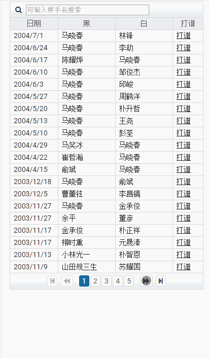
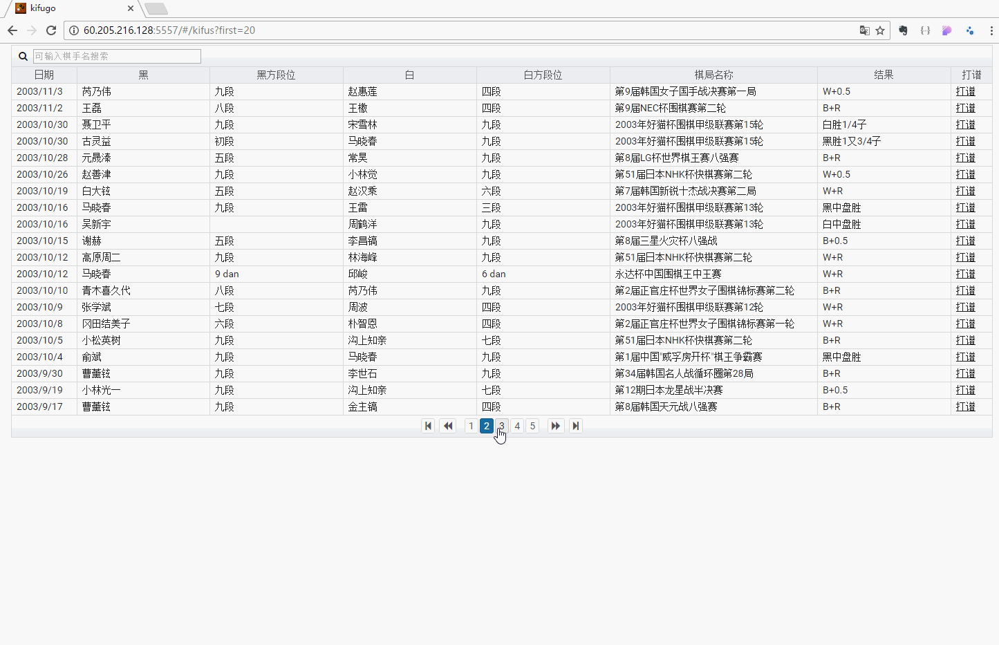
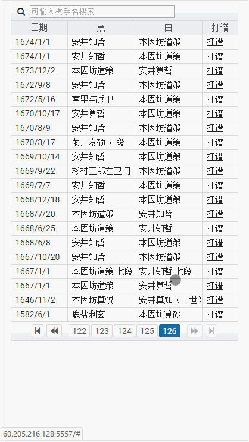

#kifugo
Hobby project to practice full stack development, practices **Angular2**, **Mongodb**,**Nodejs**,**Express**,**HTML5 SVG**,**CSS**, react programming based on **NgRx** and **Rxjs**.
Kifugo is an online go game kifu respository and kifu player.
The frontend is an **Angular2** app based on Nathan Walker's [angular-seed_advanced](https://github.com/NathanWalker/angular-seed-advanced).
The backend of this app is at [kifugo-backend](https://github.com/CG0323/kifugo-backend), which is a **Node.js** + **Mongodb** Rest API.

-------- 

## Demo
    

## Techniques Practiced:

### Angular2 Basic
`module`,`component`,`service`,`pipe`,`router`
### Primeng integration
The kifu list & searching compoent is built based on [Primeng Datatable](http://www.primefaces.org/primeng/#/datatable).
Adding primeng to the ng2 seed project is referenced to [this instruction](https://github.com/mgechev/angular-seed/wiki/Add-PrimeNG)

### Backend pagination
Go-Game kifus repository is a large dataset, it is not a good idea to load all the data once, Primeng Datatable's lazyload feature 
is used together with backend pagination:

in frontend:  

```typescript
  searchKifus(first:number, rows:number, player:string):Observable<any>{
    let headers = new Headers({ 'Content-Type': 'application/json' });
    let options = new RequestOptions({ headers: headers });
    var params = {first:first, rows:rows, player:player};
    return this.http.post(AppConfig.API_BASE + 'kifus/search', params, options)
      .map(res => {
        return {res:res.json(), params:params};
      });
  }
```
in backend:  

```javascript
router.post('/search', function(req, res, next) {
    var param = req.body;
    var first = param.first;
    var rows = param.rows;
    var player = param.player;
    var conditions = {};
    if (player) {
        conditions = { $or: [{ pb: { $regex: player } }, { pw: { $regex: player } }] };
    }
    Kifu.find(conditions)
        .sort({ dt: -1 })
        .skip(first)
        .limit(rows)
        .select('dt name pb br pw wr re km')
        .exec()
        .then(function(kifus) {
                Kifu.count(conditions, function(err, c) {
                    if (err) {
                        logger.error(err);
                        res.status(500).send("falied to get totoal count");
                    }
                    res.status(200).json({
                        totalCount: c,
                        kifus: kifus
                    })
                });
            },
            function(err) {
                res.status(500).send("failt to search kifus");
            }
        )
});
```

### Ngrx/Store
Ngrx/store is the fundation of this application. Components function together based on an immutable app state managed by ngrx/store.
The appstate has 2 sub states: playerState and kifuState. 

```typescript
const reducers = {
  kifu: fromKifuGo.kifuReducer,
  player: fromKifuGo.playerReducer
};
```
The states are managed by `reducers`, components only dispatch `actions` to `reducers`. 
For example, to handle the `Next` button, in the component which controls the kifu player:

```typescript
  onPrev(){
      this.store.dispatch(new playerAction.PrevAction());
    }
```
In player reducer:

```typescript
  case actions.ActionTypes.NEXT:{
      let stones = JSON.parse(JSON.stringify(state.stones));
      let sequence = state.sequence + 1;
      let move = state.currentNode.children[0].move;
      stones[move.x + ","+move.y] = {c: move.c, sequence: sequence};
      let currentNode = Object.assign({},state.currentNode.children[0],{parent: state.currentNode});
      let remove = CoreService.computeRemoveStones(stones, move.x, move.y);
      let removeHistory = state.removeHistory;
      if(!CoreService.isEmpty(remove)){
        removeHistory = JSON.parse(JSON.stringify(state.removeHistory));
        removeHistory[sequence] = remove;
      }
      
      for(let prop in remove){
        if(remove.hasOwnProperty(prop)){
          delete stones[prop];
        }
      }
      return (<any>Object).assign({}, state, {
        stones: stones, currentNode: currentNode, sequence:sequence, removeHistory: removeHistory
      });
    }
```
So components are light and clean, both the application data model and core bussiness logic are centralized in the store. 
Another benefit of this architecture is that it is really easy to test, since reducers are pure functions (given the same input will produce the same output.)

### Ngrx/Effects
ngrx/effects is used to handle "Side effects" of actions such as server communication via ngrx/effects:

```typescript
  @Effect() search$: Observable<Action> = this.actions$
    .ofType(kifu.ActionTypes.SEARCH)
    .startWith(new kifu.SearchAction({first: 0, rows: 20, player: null}))
    .switchMap(action => {
      var params = <SearchParam>action.payload;
      return this.kifuService.searchKifus(params.first, params.rows, params.player)}
    )
    .map(data => {
      return new kifu.LoadedAction({kifus: data.res.kifus, first: data.params.first, rows: data.params.rows, player : data.params.player, totalCount: data.res.totalCount});
    })
    .catch(() => Observable.of(new kifu.SearchFailedAction()));

```
### Rxjs operators
Rxjs observable is the essential concept of the whole application, a vairable of operators are practiced in this projects:  

```typescript
import 'rxjs/add/observable/throw';
import 'rxjs/add/operator/map';
import 'rxjs/add/operator/startWith';
import 'rxjs/add/operator/switchMap';
import 'rxjs/add/operator/catch';
import 'rxjs/add/operator/take';
import 'rxjs/add/operator/let';
import 'rxjs/add/operator/delay';
import 'rxjs/add/operator/withLatestFrom';
import 'rxjs/add/operator/combineLatest';
import 'rxjs/add/observable/of';
```

### Smart components & Dumb components
The good practice of **Smart Component** and **Dumb Components** is followed.  
For example, smart component `PlayerComponent` is composed of 3 dumb components: `ControlComponent`,`BoardComponent` and `InfoComponent`.
ControlComponent is "dumb":

```typescript
export class ControlComponent {

    @Input() disabled: boolean;
    @Input() isFirst: boolean;
    @Input() isLast: boolean;
    @Output() start = new EventEmitter<any>();
    @Output() prev = new EventEmitter<any>();
    @Output() next = new EventEmitter<any>();
    constructor() {
    }
    onStart(){
      this.start.emit();
    }
    onNext(){
      this.next.emit();
    }
    onPrevious(){
      this.prev.emit();
    }

}
``` 
PlayerComponent is "smart":
in html:

```html
<go-control 
  [disabled]="disabled$|async" 
  [isFirst]="isFirst$|async" 
  [isLast]="isLast$|async" 
  (start)="onStart()" 
  (prev)="onPrev()" 
  (next)="onNext()">
</go-control>
```

in js:

```typescript
constructor(private store: Store<IAppState>, private router: Router, private route: ActivatedRoute, private location:Location) {
      let id = this.route.snapshot.params['id'];
      this.store.dispatch(new playerAction.InitAction(id));

      this.disabled$ = store.let(getIsNotInKifu);
      this.isFirst$ = store.let(getIsFirst);
      this.isLast$ = store.let(getIsLast);
      this.comment$ = store.let(getComment);
      this.kifu$ = store.let(getBoardKifu);
      this.stones$ = store.let(getStones);
      this.currentSequence$ = store.let(getSequence);
  }

  onStart(){
      this.store.dispatch(new playerAction.StartAction());
    }

  onNext(){
      this.store.dispatch(new playerAction.NextAction());
    }

  onPrev(){
      this.store.dispatch(new playerAction.PrevAction());
    }
```

### HTML5 SVG
The go game board is drawn with HTML5 svg elements such as `path`, `rect`, `circle` and `gradient`
### Media query
The app is aimed to be used on both desktop and mobile device.
Different css is defined according to Media query.
In desktop browser:  


In mobile browser (iphone 6 plus):  

## License
MIT